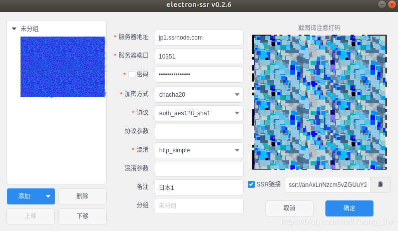
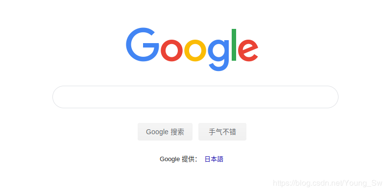

# Ubuntu下使用SSR科学上网

## 一、准备

- 操作系统：ubuntu14.04、ubuntu16.04、ubuntu18.04 及以上(已测试过的)

- ssr：使用 ```electron-ssr-0.2.6```客户端
  下载地址：[点击下载](https://github.com/youngsw/ssr_Ubuntu)（这里是github下载，如果不能翻墙的朋友可能会有点慢，请用百度网盘下载）
  
  百度网盘下载地址：[网盘地址](https://pan.baidu.com/s/1r6v9yDDb5gYJZRPmwp_XOg)  密码: bc3s

## 二、安装

- 点击已经下载的` .deb`文件进行安装
- 安装完后如图
  
  
- 随后的操作和windows、Android下的操作一样，登录自己的账号就可舒舒服服的使用了google、youtube。

## 三、注意事项

- 第一次使用时，如果登录后不能成功科学上网的话，可以试试重启设备。
- 如果登陆后没有成功的话，可能是因为PAC文件没有更新，此时在终端中使用```sudo electron-ssr```让其初始化即可。 
